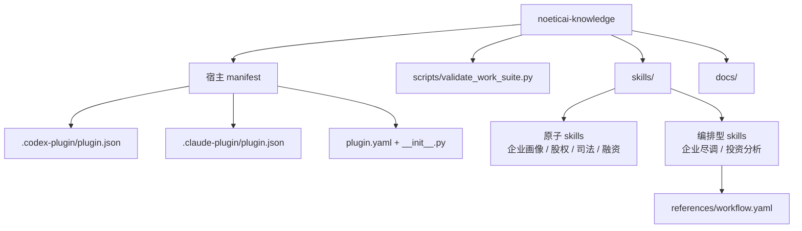
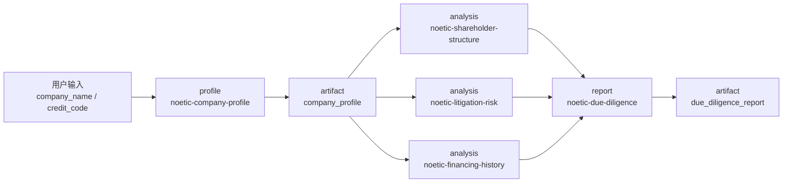
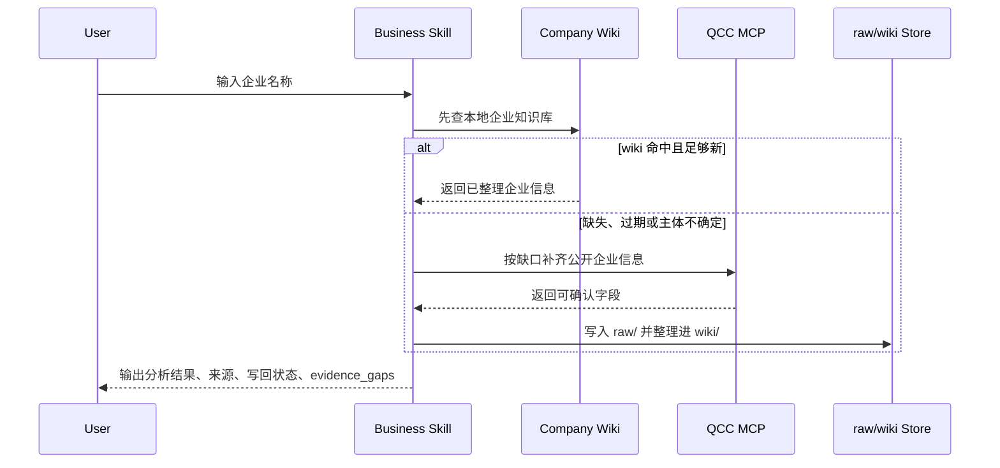
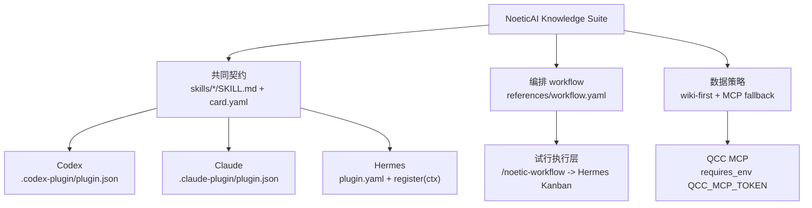
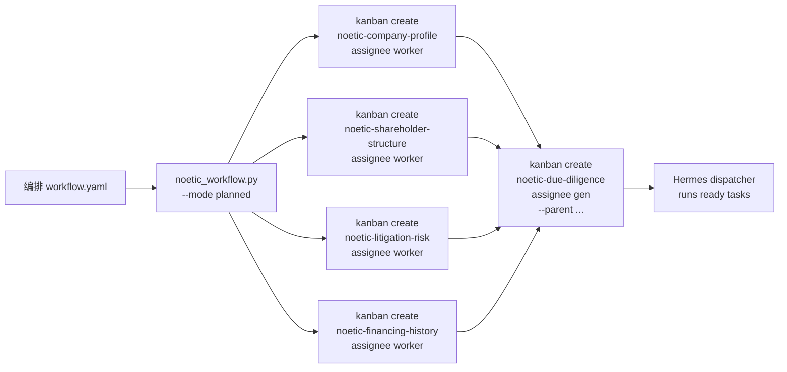
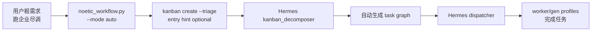

# NoeticAI Knowledge 插件化调研情况

> 日期：2026-07-03
> 范围：`noeticai-knowledge` 作为多宿主 skills 插件的结构、manifest、workflow、数据接入与执行边界。

## 结论摘要

`noeticai-knowledge` 适合按 skills-first 插件组织，而不是按传统应用服务或独立 workflow runner 组织。

当前可落地的最小方案是：

- 以 `skills/*/SKILL.md` 作为跨宿主可发现入口。
- 每张知识卡片保持独立 skill；需要标准前置流程时，由编排型 skill 的 `references/workflow.yaml` 声明依赖。
- 编排型 skill 的前置流程放在 `skills/<orchestrating-skill>/references/workflow.yaml`。
- 各宿主只保留必要 manifest：`.codex-plugin/plugin.json`、`.claude-plugin/plugin.json`、`plugin.yaml`。
- 用 `scripts/validate_work_suite.py` 做静态兼容校验，而不是为每个平台写一套校验器。
- 企业数据默认 wiki-first，只有缺失、过期或主体不确定时再补齐公开企业信息，并写回用户本地企业知识库。

暂不把本仓库做成完整 runtime。workflow 执行层目前只作为试行后端存在，通用插件契约仍保持静态、可读、可校验。

## 调研背景

原 NoeticAI 企业知识卡片包含两类核心内容：

- 分析规则：企业画像、股权结构、司法风险、融资历史、尽调报告、投资分析等。
- 数据需求：工商、股权、风险、融资、经营、管理层等外部企业信息。

插件化目标不是迁移后端服务，而是把这些知识卡片整理成能被 Hermes、Codex、Qoder 等宿主加载的专家能力包。调研中确认，最稳定的抽象是“插件提供 skills，workflow 只是编排型 skill 内部的业务 SOP”。

## 宿主兼容面

| 宿主/入口 | 当前文件 | 调研结论 |
| --- | --- | --- |
| Codex | `.codex-plugin/plugin.json` | 作为 Codex manifest，声明插件元信息、skills 目录和 MCP companion 配置。 |
| Claude/Hermes 兼容 manifest | `.claude-plugin/plugin.json` | 保留轻量 manifest，避免把 workflow 自定义字段塞进宿主 manifest。 |
| Hermes plugin shell | `plugin.yaml`、`__init__.py` | `plugin.yaml` 声明 QCC token、MCP servers 和 skills；`register(ctx)` 动态注册 `skills/*/SKILL.md`。 |
| Work Suite 静态契约 | `scripts/validate_work_suite.py` | 一个校验脚本覆盖 `work-suite|codex|claude|hermes|all`，避免多套规则漂移。 |

Hermes 侧需要特别区分三层：

- plugin 目录：插件安装/启用状态。
- flat skill 目录：`~/.hermes/skills` 和 `skills.external_dirs` 里的普通 skill 发现。
- MCP 配置：`~/.hermes/config.yaml` 或宿主导入的 `mcp_servers`。

插件注册 skill 不等于把 skill 复制到 flat `/` skill 列表；这是宿主发现机制差异，不是本仓库目录错误。

## Work Suite 结构取舍

调研中放弃了顶层 `workflows/` 作为用户入口的模型。原因是它会让 workflow 看起来像独立产品入口，而实际跨宿主可发现面仍是 skill。

当前采用：

```text
skills/
  noetic-company-profile/
    SKILL.md
    card.yaml
  noetic-due-diligence/
    SKILL.md
    card.yaml
    references/
      workflow.yaml
```

这样有几个好处：

- 用户和宿主看到的是统一的 skill。
- 前置流程跟随编排型 skill，不需要额外 workflow 注册入口。
- 静态校验可以检查 stage 引用、artifact 输入输出和 manifest 名称一致性。
- 后续换执行层时，不需要改业务 skill 的公开契约。

`workflow.yaml` 只表达 stage、skills、inputs、outputs、parallel 等最小语义。复杂调度、模型运行、持久化状态不放进 v1 规范。

## 数据与 MCP 调研结论

企查查类 MCP 是必要数据源，但不应让每次卡片调用都直接付费查询。

当前策略：

- 默认先查用户本地企业知识库，路径为 `~/.noeticai/company-knowledge`。
- 可用 `NOETICAI_COMPANY_KB_DIR` 覆盖知识库目录。
- 只有 wiki 无命中、字段缺失、主体不确定或信息明显过期时，才补齐公开企业信息。
- 补齐后写入 `raw/`，再整理进 `wiki/`。
- business skill 最终标注 wiki 写回状态，并用 `evidence_gaps` 记录无法确认的信息。

Hermes manifest 中 QCC 当前按强依赖处理：

- `requires_env` 声明 `QCC_MCP_TOKEN`。
- `mcp_servers` 用 `${QCC_MCP_TOKEN}` 做 bearer auth。
- 不把真实 token 或企业数据提交到仓库。

### Hermes MCP 接入边界

当前 Hermes plugin install 更适合安装 skill/plugin shell，不宜假设它会完整接管 MCP server 生命周期。Hermes 侧至少存在三层独立状态：

- plugin install/enable：决定 Noetic skills 是否可被宿主发现。
- skill discovery：决定 flat `/` skill 列表或 profile-local skills 是否能看到 Noetic skill。
- MCP runtime config：通常仍落在 `~/.hermes/config.yaml` 或宿主自己的连接器配置中。

如果把 QCC 的 6 个 MCP server 全部直接写入 Hermes 全局配置，能快速接通，但会带来几个问题：

- `~/.hermes/config.yaml` 膨胀，且插件卸载不一定能自动清理 MCP 配置。
- token、连接状态、插件启用状态容易分散在不同页面或文件里。
- 业务 skill 容易误绑定具体 MCP 工具名，削弱后续替换数据源的空间。

一个更轻的 Hermes 路线是由插件提供共享 CLI，例如：

```bash
noetic qcc doctor --json
noetic qcc company "企业名" --json
noetic qcc risk "企业名" --json
noetic qcc history "企业名" --json
```

CLI 只负责 token 读取、QCC MCP 调用、结构化 JSON 输出和错误归一化；Hermes skill 调用 CLI 获取企业公开数据，不直接维护 6 个 MCP server。这样 `plugin.yaml` 中的 `mcp_servers` 可以保留为跨平台 companion 声明，给 Codex/Cursor 等 MCP 体验更好的宿主使用；Hermes 默认走 CLI 数据适配层，避免全局 MCP 配置继续膨胀。

首版不需要完整打包成独立产品，可以先用仓库根目录的 `scripts/noetic.py` 验证 `qcc doctor/company/risk/history --json`。只有当命令名需要稳定安装时，再增加 `bin/noetic` 或 Python package 结构。

## 具体示例

### 示例 1：单卡 skill

`skills/noetic-company-profile/card.yaml` 把企业画像定义为一个独立卡片：

```yaml
id: noetic-company-profile
name: 企业画像
description: 汇总目标企业基本信息、经营状态、行业定位与核心标签，为后续分析提供统一主体上下文。

inputs:
  - company_name
  - unified_social_credit_code

data_needs:
  - 查询企业工商基本信息，包括企业名称、统一社会信用代码、法定代表人、注册资本、成立日期、经营状态、注册地址、经营范围
  - 查询企业所属行业与主营业务
  - 查询企业规模信号（参保人数、分支机构、资质许可等公开信息）
  - 查询近期经营异常、行政处罚等公开记录

outputs:
  - company_summary
  - industry_position
  - operating_status
  - key_tags
  - risk_flags
  - company_wiki_writeback_status
  - evidence_gaps
```

这类 skill 的重点是声明业务输入、数据需求和输出产物，不绑定某个后端函数名。宿主加载到 skill 后，执行说明来自同目录的 `SKILL.md`，结构化元数据来自 `card.yaml`。

### 示例 2：编排型 skill 的 workflow

`skills/noetic-due-diligence/references/workflow.yaml` 声明企业尽调在生成报告前需要哪些前置 stage 与产物：

```yaml
name: 企业尽调
stages:
  - id: profile
    skills: [noetic-company-profile]
    outputs: [company_profile]

  - id: analysis
    skills: [noetic-shareholder-structure, noetic-litigation-risk, noetic-financing-history]
    inputs: [company_profile]
    parallel: true
    outputs: [shareholder_structure, litigation_risk, financing_history]

  - id: report
    skills: [noetic-due-diligence]
    inputs: [company_profile, shareholder_structure, litigation_risk, financing_history]
    outputs: [due_diligence_report]
```

`noetic-due-diligence` 是编排型 skill：自身负责汇总报告，workflow 声明其终端能力依赖哪些前置产物。所有 skill 能力对等，差别在于是否附带标准 SOP 编排。

### 示例 3：用户调用

用户可以直接调用原子 skill：

```text
查询「杭州XX科技有限公司」的企业基本信息
```

也可以直接表达顶层业务意图，由编排型 skill 承接：

```text
对「杭州XX科技有限公司」做企业尽调
```

编排型 skill 缺少前置产物时，应转交 `/noetic-workflow` 使用对应 `workflow.yaml` 生成执行计划，而不是在报告 skill 内临时硬编码串行调用逻辑。

### 示例 4：Hermes plugin 注册

Hermes shell 保持最小：`__init__.py` 扫描 `skills/*/SKILL.md`，逐个注册。

```python
def register(ctx):
    plugin_dir = Path(__file__).parent

    skills_dir = plugin_dir / "skills"
    for child in sorted(skills_dir.iterdir() if skills_dir.exists() else []):
        skill_md = child / "SKILL.md"
        if child.is_dir() and skill_md.exists():
            ctx.register_skill(child.name, skill_md)
```

因此新增 skill 时，通常只需要新增 `skills/<name>/SKILL.md`；如果是知识卡片，再补 `card.yaml` 和必要的 workflow 引用。

### 示例 5：Kanban 手动编排 planned

手动编排不是让用户逐条手写所有 Kanban task，而是由 `/noetic-workflow` 读取编排型 skill 的 `workflow.yaml`，确定性生成多条 `hermes kanban create` 命令。它适合标准尽调、投资分析这类需要可复现 DAG 的流程。

```bash
python skills/noetic-workflow/scripts/noetic_workflow.py execute \
  --mode planned \
  --skill noetic-due-diligence \
  --company "杭州XX科技有限公司" \
  --workspace "dir:/absolute/path/to/noetic-run" \
  --dry-run
```

`--dry-run` 只打印将要创建的 Kanban task，不提交给 Hermes。确认无误后改成 `--apply`：

```bash
python skills/noetic-workflow/scripts/noetic_workflow.py execute \
  --mode planned \
  --skill noetic-due-diligence \
  --company "杭州XX科技有限公司" \
  --workspace "dir:/absolute/path/to/noetic-run" \
  --apply
```

planned 模式会把 workflow stage 转成 Kanban parent 关系。例如企业尽调会先创建画像、股权、司法、融资等 worker task，再创建依赖这些 parent 的报告 task。

运行前需要准备 Hermes board、gateway，以及 `worker` / `gen` profile：

```bash
hermes kanban init
hermes gateway start
hermes profile create worker --clone --description "Runs Noetic worker knowledge cards and returns structured artifacts with evidence gaps."
hermes profile create gen --clone --description "Runs Noetic orchestrating report cards from parent task artifacts. It does not invent missing facts."
```

### 示例 6：Kanban 自动编排 auto

自动编排不读取 `workflow.yaml` 生成固定 DAG，而是创建一条 triage task，由 Hermes `kanban_decomposer` 根据任务正文自动拆图。它适合粗粒度、探索式需求。

```bash
python skills/noetic-workflow/scripts/noetic_workflow.py execute \
  --mode auto \
  --company "杭州XX科技有限公司" \
  --skill noetic-due-diligence \
  --dispatch \
  --apply
```

`--skill` 在 auto 模式下只是编排型 skill 提示，不保证最终拓扑与该 skill 的 `workflow.yaml` 一致。`--dispatch` 会在创建 triage task 后立即触发 dispatcher，避免等待下一次调度 tick。

auto 模式的前置条件是：

- Hermes gateway 已启动。
- `~/.hermes/config.yaml` 中 `kanban.auto_decompose` 为 true。
- profile 描述足够清晰，便于 Hermes 自动路由任务。

### planned 与 auto 对比

| 模式 | 也可理解为 | 编排来源 | 产物形态 | 适用场景 |
| --- | --- | --- | --- | --- |
| `planned` | 手动/标准编排 | `references/workflow.yaml` | 多条 Kanban task，显式 parent 依赖 | 标准尽调、投分、需要可复现 DAG |
| `auto` | 自动编排 | Hermes triage/decomposer | 单条 triage task 触发自动拆图 | 粗需求、探索式拆解、试运行 |

`compile`、`dry-run`、`apply` 的边界也要分清：

- `compile`：只打印本地 DAG JSON，不调用 Hermes。
- `execute --dry-run`：打印将要执行的 `hermes kanban create` 命令，不创建 task。
- `execute --apply`：真正提交 Kanban task 给 Hermes。

## 图示

### 插件结构图



### 企业尽调 workflow 图



### 企业数据查询与写回图



### 宿主兼容边界图



### Kanban planned 手动编排图



### Kanban auto 自动编排图



## 已落地内容

- 多宿主 manifest：`.codex-plugin/plugin.json`、`.claude-plugin/plugin.json`、`plugin.yaml`。
- Hermes 注册入口：`__init__.py` 中扫描 `skills/*/SKILL.md` 并注册 skill。
- 统一静态校验：`scripts/validate_work_suite.py` 支持 `--target all|work-suite|codex|claude|hermes`。
- skill 命名统一使用 `noetic-` 前缀。
- 编排 workflow 已收口到编排型 skill 的 `references/workflow.yaml`。
- 企业数据策略已改为每个业务 skill 自行 wiki-first lookup/writeback，不再依赖独立 data-source gateway。
- `/noetic-workflow` 作为 workflow 管理与试行执行入口，区分 planned workflow 和 Hermes auto triage。

## 未纳入本阶段

- 独立 workflow runtime。
- 数据库 schema 迁移。
- MCP 工具名自动映射。
- 卡片 DAG 可视化。
- 为不同宿主生成多套重复校验器。
- 为旧目录结构保留 alias 或兼容 shim。

这些都不是当前插件化闭环的必要条件；等出现真实运行需求或宿主契约变化后再补。

## 风险与待验证项

| 项目 | 当前判断 | 后续触发条件 |
| --- | --- | --- |
| Hermes plugin skill 是否出现在 flat `/` 列表 | 不保证；plugin registry skill 与 flat skill discovery 是两套机制。 | 如果产品要求 slash command 直出，需要补宿主侧能力或安装视图。 |
| `plugin.yaml` YAML 形态 | validator 只支持最小 YAML 子集。 | 需要复杂 YAML 时，先扩 validator，不要绕过校验。 |
| QCC MCP 真实连通性 | manifest 已配置强依赖和 bearer auth；真实调用仍依赖宿主环境 token。 | 做端到端企业查询前，需要用真实 token 做 JSON-RPC POST 验证。 |
| Hermes MCP 配置膨胀 | 直接把 QCC MCP servers 写入全局配置可行，但 plugin install 不一定能管理清理、token 和状态。 | Hermes 侧优先验证 `noetic` CLI 适配层；只有需要原生 MCP 工具发现时再同步到 `~/.hermes/config.yaml`。 |
| workflow 执行 | 当前有 Hermes Kanban 试行后端，但通用契约不绑定 Hermes。 | 需要稳定生产执行时，再固化 runner 契约、状态和错误恢复。 |
| 多平台差异 | 目前以最小 manifest + shared skills 兼容。 | 某宿主要求专属字段时，只在对应 manifest 增量添加。 |

## 建议路线

1. 保持当前 skills-first 结构，不恢复顶层 `workflows/`。
2. 继续把 `scripts/validate_work_suite.py .` 作为提交前主校验。
3. 只在真实宿主行为需要时扩展对应 manifest。
4. 先验证 QCC MCP 端到端调用，再考虑更细的工具映射。
5. Hermes 侧优先尝试共享 CLI 作为 QCC 数据适配层，避免默认膨胀 `~/.hermes/config.yaml`。
6. Hermes Kanban 继续作为试行执行层；不要把 Hermes 后端细节写进普通业务 skill 契约。
